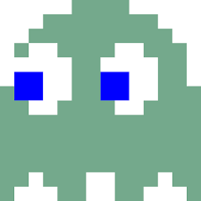
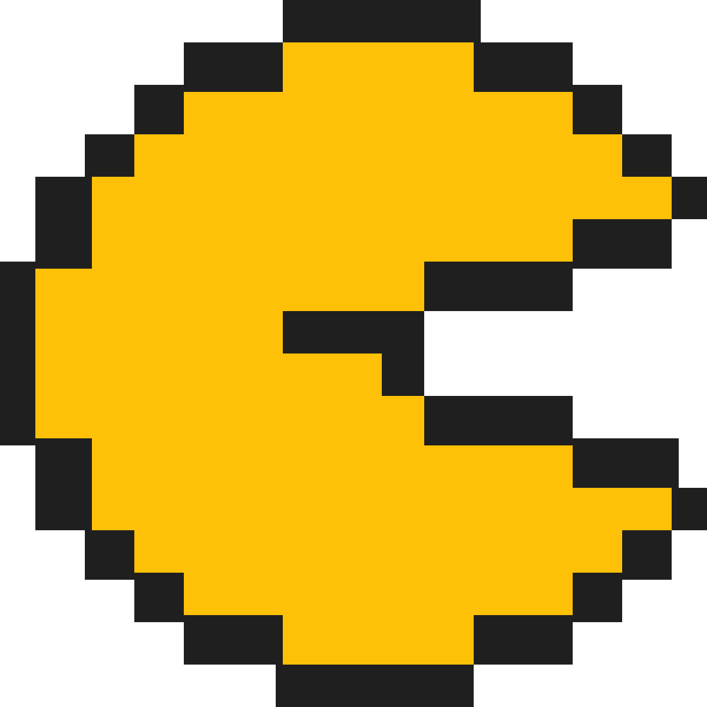
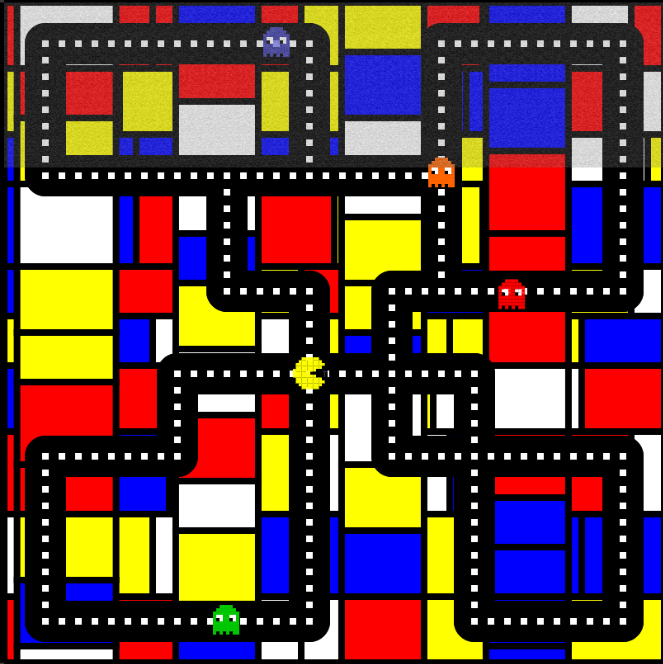
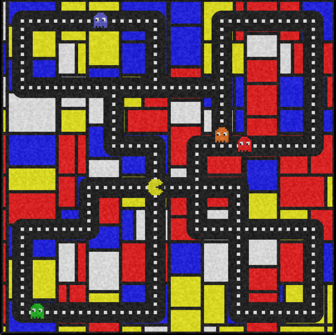

# yhou0161_9103_individual-project_Perlin Noise Animation

Perlin Noise can introduce smooth random movements and enhance visual effects. For this personal assignment, I will also use Perlin Noise to create various animation effects.

## 🎮 Interaction

Since my task is to animate with Perlin Noise, the animation is random. Therefore, I didn’t create many interactions. Instead, I focused more on effects and animations. The only interaction present is a slider on the right side of the game console, which controls the movement range of the Green Ghost:
- Slide to the right to increase its range of motion.
- Slide to the left to decrease its range of motion.

The concert will play automatically after you open the window and will loop.

## 💡 Details and Approaches

In the arcade screen, we have set up five characters, including four colourful ghosts and a yellow Pac-Man. I created unique animation effects for each of these five characters.

### Red Ghost 

The red ghost moves back and forth parallel to the passage it occupies. However, it is clearly more restless. Perlin Noise causes it to shake up and down, floating within the channel range, enhancing its ghostly effect.

```
function drawRedGhost() {
  // change the location
  redGhostX += redGhostSpeed * redDirection;

  // change the direction
  if (redGhostX >= 375) {
    redGhostX = 375;
    redDirection = -1;
  }else if (redGhostX <= 235) {
    redGhostX = 235;
    redDirection = 1;
  }

  //nosie to shake the ghost.
  //Redefine the range of noise to ensure that the fluctuations of the target up, down, left, and right are controlled within 5 pixels.
  let noiseX = map(noise(redGhostNoiseX), 0, 1, -5.5, 5.5);
  let noiseY = map(noise(redGhostNoiseY), 0, 1, -5.5, 5.5);

  //the frequency (larger = faster)
  redGhostNoiseX += 0.03;
  redGhostNoiseY += 0.03;

  // draw Red Ghost
  drawPixelGhost(redGhostX - 40 + noiseX, 175 + 260 + noiseY, color(255, 0, 0));
}
```

### Orange Ghost 

Similar to the principle of the red Ghost, the Perlin Noise here controls Orange Ghost's speed. Keep it between 0.5 and 2.

```
let noiseSpeed = map(noise(orangeGhostNoise), 0, 1, 0.5, 2);
  orangeGhostY += orangeGhostSpeed * orangeDirection * noiseSpeed;
```

### Purple Ghost 

Compared to other ghosts, the purple ghost appears quite shy. Perlin Noise influences its transparency, causing it to flicker. The Alpha channel defines the transparency of pixels. Thus, I adjust its random range between 25 and 255 to ensure it is not completely transparent.

```
let alphaNoise = map(noise(purpleNoise), 0, 1, 25, 255);

  purpleNoise += 0.07;

  let purpleColour = color(90, 90, 255, alphaNoise);
  drawPixelGhost(purpleGhostX - 40, 285, purpleColour);
```

### Green Ghost 

The green ghost is a lively and cheerful character, and it is very eager to interact with you. I set up a slider for the green ghost, which controls the amplitude of the green ghost’s movement.

```
let noiseValue = greenGhostSlider.value();

  let noiseX = map(noise(greenNoiseX), 0, 1, -noiseValue, noiseValue);
  let noiseY = map(noise(greenNoiseY), 0, 1, -noiseValue, noiseValue);

  greenNoiseX += 0.02;
  greenNoiseY += 0.02;

  drawPixelGhost(greenGhostX + noiseX - 40, 635 + noiseY, color(0, 200, 0));
```

### Pac Man 

Pac-Man is the protagonist of the game, but this time it encounters four ghosts with different abilities, so it appears nervous this time. Perlin Noise affects its size, making it seem as if it is breathing tensely.

```
function drawPacman(){
  pacmanScale = map(noise(pacmanNoise), 0, 1, 1, 2);

  pacmanNoise += 0.02;

  drawPixelPacman(143, 485, color(255, 255, 0), pacmanScale);
}
```

Since my team members completed the Pac-Man drawing work, it was ineffective when I tried to change its size. Subsequently, during the inspection, I found that my teammate fixed the size in the code.

```
function drawPixelPacman(x, y, bodyColor) {
  const s = 2;
  ...
  rect(x + col * s, y + row * s, s, s);}
```

Therefore, I modified it to turn it into a variable.
```
function drawPixelPacman(x, y, bodyColor, pacmanScale) {
  const s = pacmanScale;
  ...
  rect(x + col * s, y + row * s, s, s);}
```

### Noise Effect 🎞️

Ultimately, I aim to utilize Perlin Noise to evoke the sensation of an old machine and demonstrate the effect of snowflakes. So, I covered the screen with a layer of semi-transparent snowflakes, similar to the effect of a filter.

```
function drawNoiseLayer(){
  noiseLayer.loadPixels();

  //the size of the noise
  let noiseSize = 0.7;
  for(let x = 0; x < noiseLayer.width; x++){
    for(let y = 0; y < noiseLayer.height; y++){
      let noiseEffect = noise(x * noiseSize, y * noiseSize, noiseTime);
      let noiseBright = map(noiseEffect, 0, 1, 0, 255);

      let rgbaIndex = (x + y * noiseLayer.width) * 4;
      noiseLayer.pixels[rgbaIndex] = noiseBright;
      noiseLayer.pixels[rgbaIndex + 1] = noiseBright;
      noiseLayer.pixels[rgbaIndex + 2] = noiseBright;
      noiseLayer.pixels[rgbaIndex + 3] = 75;
    }
  }

  noiseLayer.updatePixels();
  noiseTime += 0.09;

  image(noiseLayer, 138 + offsetX, 270);
}
```

In this effect, I used loadPixels() and updatePixels(). It can load the current value of each pixel on the canvas into the pixels array.

[p5.js loadPixels Reference]https://p5js.org/reference/p5/loadPixels/

After querying the principle, the colour of the pixel will be divided into four elements, from 0 to 3, namely r, g, b, and alpha. RGB will be determined by Perlin Noise and display the effect of flashing snowflakes. Finally, use the Alpha represented by "+3" to ensure a certain degree of transparency.

[p5.js Pixels Reference]https://p5js.org/reference/p5/pixels/

## ✨ Improvement

After completing all the code, I discovered that the snowflake effect of the old screen produces inaccurate results on screens with different resolutions. Previewing on a high-resolution screen causes the height of the NoiseLayer to shrink significantly, preventing it from covering the entire image.

 

Since I was unable to identify the problem, I handed over the NoiseLayer part of the code to ChatGPT for inspection. ChatGPT informed me that when I zoom in the browser and adjust the zoom ratio to greater than 100%, or display it on a monitor with a higher resolution, the browser internally adjusts the **devicePixelRatio**. Because the logic of p5.js ignores the **devicePixelRatio** by default, even if the NoiseLayer size is guaranteed to be 400x400 in p5.js, the **devicePixelRatio** of the browser will exceed 1. This caused me to see it stretching or narrowing.

```
 noiseLayer = createGraphics(screenSize, screenSize);
 noiseLayer.pixelDensity(1);
```
ChatGPT informed me that the pixelDensity of p5.js can be manually set to 1 to ensure consistency between logical pixels and physical pixels.